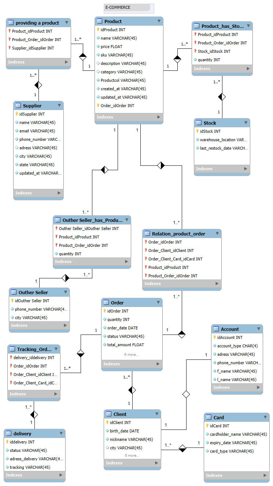

# BootCamp Suzano 🚀

# E-Commerce Database 🛒

Este repositório contém o modelo de banco de dados para um sistema de **E-commerce**, implementado em MySQL. O banco de dados foi projetado para gerenciar as informações de produtos, pedidos, clientes, fornecedores, e pagamentos, entre outros aspectos de um sistema de compras online. 📦

## Estrutura do Banco de Dados 🗂️

O banco de dados é composto pelas seguintes tabelas principais:

- **Client** 👥: Armazena informações dos clientes (pessoas físicas e jurídicas).
- **Account** 💳: Contém informações sobre a conta do cliente, incluindo CPF e CNPJ.
- **Product** 🏷️: Armazena os produtos disponíveis para venda.
- **Stock** 📦: Gerencia o estoque de produtos.
- **Order** 📝: Contém os detalhes de cada pedido realizado.
- **Supplier** 🏢: Armazena dados dos fornecedores de produtos.
- **Other Seller** 👨‍💻: Representa vendedores alternativos que também podem oferecer produtos.
- **Delivery** 🚚: Gerencia as informações de entrega e rastreamento de pedidos.
- **Card** 💳: Armazena os dados dos cartões de pagamento associados aos clientes.

## Relacionamentos Entre as Tabelas 🔗

A estrutura do banco de dados está organizada de forma relacional. Abaixo estão alguns dos principais relacionamentos entre as tabelas:

- **Client** 👥 1:N **Order** 📝: Um cliente pode fazer vários pedidos, mas um pedido pertence a apenas um cliente.
- **Product** 🏷️ 1:N **Stock** 📦: Cada produto pode ter múltiplas entradas de estoque, associadas a diferentes locais de armazenamento.
- **Supplier** 🏢 1:N **Product** 🏷️: Um fornecedor pode fornecer múltiplos produtos.
- **Order** 📝 1:N **Delivery** 🚚: Cada pedido pode ter uma ou mais entregas associadas.
- **Account** 💳 1:1 **Client** 👥: Cada cliente tem uma conta associada que pode conter um CPF ou CNPJ.
- **Card** 💳 1:N **Client** 👥: Um cliente pode ter múltiplos cartões de pagamento associados.

# E-Commerce Database

